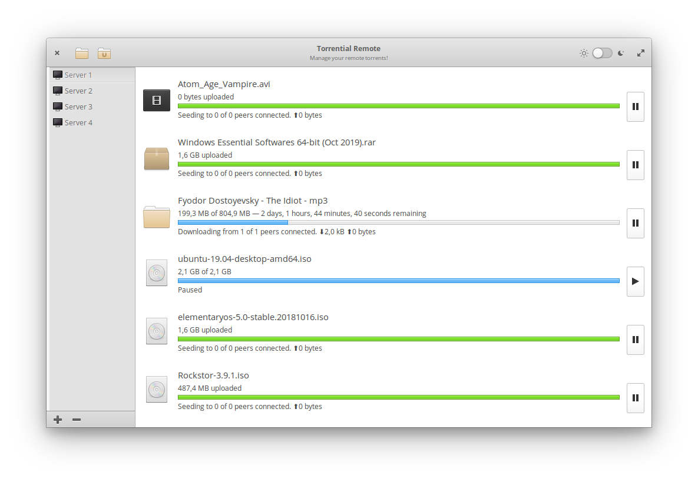
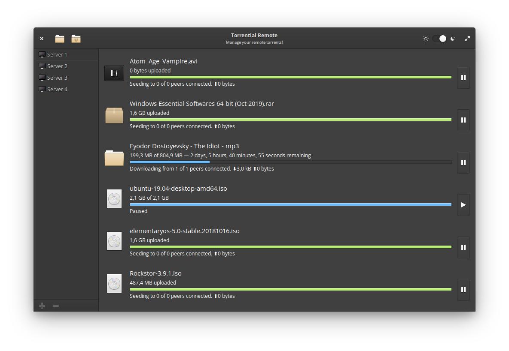

# Torrential Remote

Inspired by [David Hewitt](https://github.com/davidmhewitt)'s wonderful [Torrential](https://github.com/davidmhewitt/torrential) application, Torrential Remote allows for the remote management of multiple torrent servers. It will incorporate the minimal functionality needed to control torrents from one (or more) remote torrent servers.

## TODO
- [x] Retrieve the torrents from a server
- [x] Show the torrents in a list
- [x] Dynamically update the displayed torrents
- [ ] Add server dialog and welcome page
- [x] Build saved servers side panel
- [x] Add torrent from file
- [x] Add torrent from magnet link
- [ ] Pause and resume torrent download
- [ ] Remove torrent
- [ ] Torrents sorting and filtering
- [ ] Implement error messages

## Dependencies
* valac
* libgtk-3-dev
* libgranite-dev
* libunity-dev
* libsoup-2.4
* json-glib-1.0

## Building and Installation
    git clone https://github.com/popvladaurel/Torrential-Remote.git
    cd Torrential-Remote
    meson build --prefix=/usr
    cd build
    ninja
    sudo ninja install
